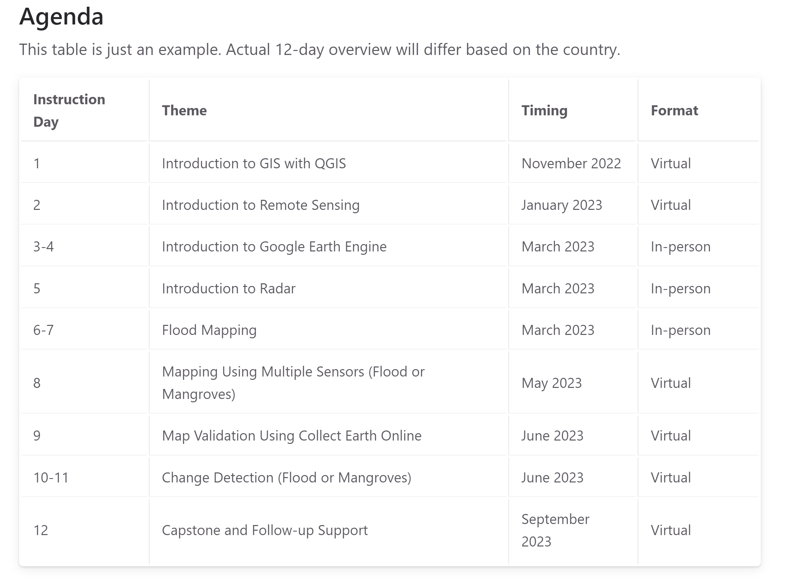

# Caribbean trainings page template

This repository is a template to set up a website on [`github-pages`](https://pages.github.com/) that hosts all the content (step-by-step instructions, slides, code, recordings, photos, etc) for training workshops.

:construction: Under Construction :construction:

:construction: Everything below this line is under construction and not final :construction:

## Configuration

The repository is configured according to the following structure:

```
repository (caribbean-trainings)
├── config.yml
├── README.md
├── index.md
├── _includes
│   ├── head_custom.html
│   ├── head.html
├── lesson1/day1 ("intro-to-gis")
│   ├── lesson1/day1.md ("intro-to-gis.md")
│   ├── introduction.md
│   ├── topic1.md
│   ├── topic2.md
│   ├── .....
├── lesson2/day2 ("intro-to-remote-sensing")
│   ├── lesson1/day1.md ("intro-to-remote-sensing.md")
│   ├── introduction.md
│   ├── topic1.md
│   ├── topic2.md
│   ├── .....
├── ..... (other lessons/days)
├── images
│   ├── lesson1/day1-images ("intro-to-remote-sensing-images")
│   │   ├── file.png ("reflected-energy-radiation.png")
│   │   ├── .....
│   ├── lesson2/day2-images
│   │   ├── .....
├── partners
├── resources
└── photos
```

## Setup Instructions

1. Click on `Use this template` and then `Create new repository` to create a new repository for your workshop. Select the location and name of the repository as you desire.


2. Update the `README.md` file with the description of your repository.

3. config.yml

3. Got to the `index.md` file and update it according to your country or title of workshop/training.


4. In the `index.md` file, The `Questions`, `Feedback`, and `Workshop Recordings` sections are buttons that link into specific Google Forms or Drive folders. Update the URLs appropriately.

e.g.: `[Give Feedback](https://forms.gle/8Jdm1aybL9sqzNEw6){: .btn .btn-purple }`

5. You can use the [Tables Generator](https://www.tablesgenerator.com/markdown_tables) to update the workshop `Agenda` in the `index.md` file: 




